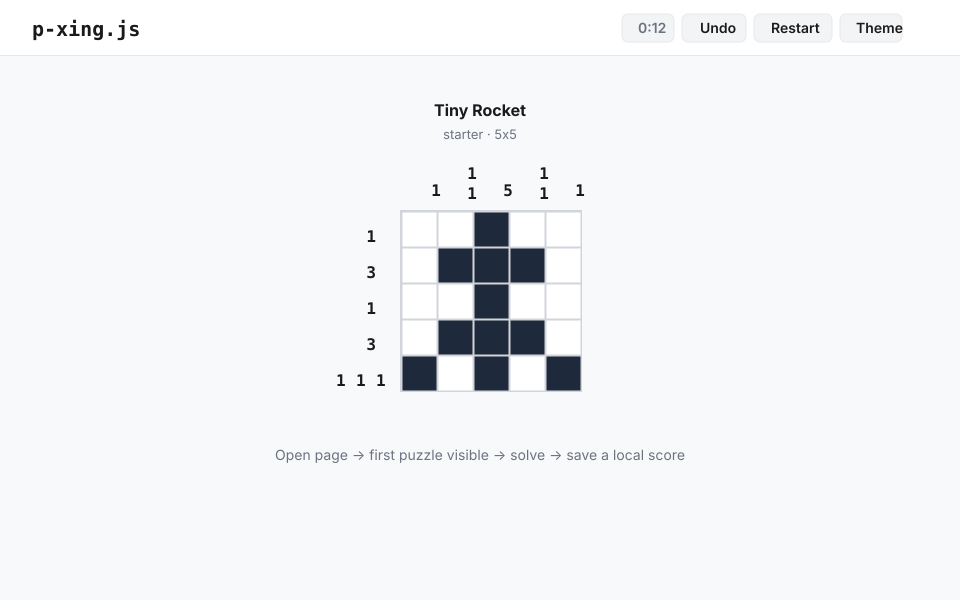

# p-xing.js

> pixel crossing · daily puzzle arcade

A minimalist browser-based pixel crossing puzzle game. Open the page, start playing — no account, no onboarding, no friction.

**Terminology:** this project uses the term **pixel crossing** everywhere. The game is a pixel crossing puzzle.

---

## Live demo

_Coming soon — deployed at `https://<owner>.github.io/p-xing.js/`_



---

## Controls

**Desktop**

| Action          | Control                  |
| --------------- | ------------------------ |
| Fill pixel      | left click               |
| Cross pixel     | right click              |
| Erase           | click active state again |
| Drag fill/cross | hold and drag            |
| Undo            | `Ctrl+Z` or `U`          |
| Restart         | `R`                      |
| Help            | `?` or Help button       |
| Toggle theme    | theme button             |

**Mobile**

| Action      | Control              |
| ----------- | -------------------- |
| Fill pixel  | tap                  |
| Cross pixel | long press (~500 ms) |

---

## Browser support

- Firefox latest
- Chrome latest
- Safari latest
- Mobile Safari
- Chrome Android

---

## Local development

```bash
npm install
npm run dev        # http://localhost:5173/p-xing.js/
```

## Tests

```bash
npm test           # unit tests (single run)
npm run test:watch # unit tests in watch mode
npm run coverage   # unit tests + coverage report
npm run e2e        # Playwright E2E tests
```

Playwright needs local browser binaries before the full E2E matrix can run:

```bash
npx playwright install
```

## Build

```bash
npm run build      # production build → dist/
npm run preview    # preview production build locally
```

## Full CI check

```bash
npm run ci
```

Runs: forbidden-term check → format check → lint → typecheck → coverage → build → HTML validation → privacy check → E2E → Lighthouse CI.

## GitHub Pages deployment

Push to `main`. The [pages workflow](.github/workflows/pages.yml) builds and deploys automatically.

In your GitHub repository settings: **Pages → Build and deployment → Source → GitHub Actions**.

---

## License

MIT
